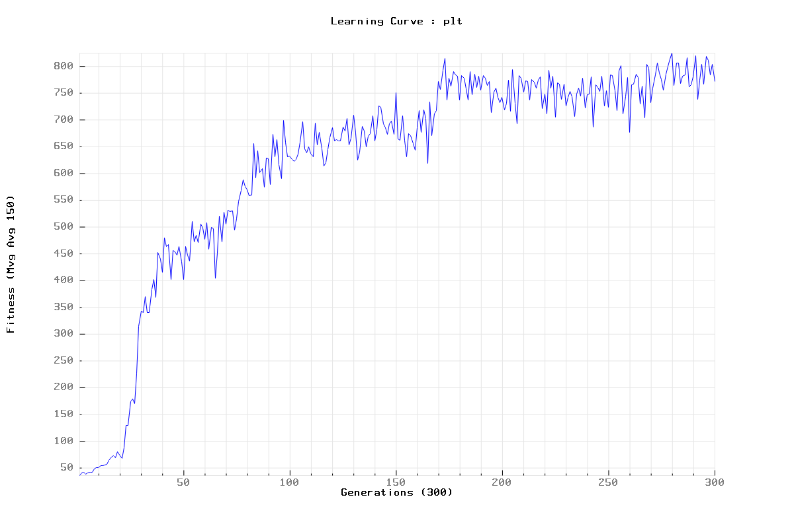
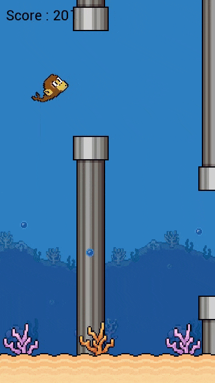

# NEAT - FLAPPY BIRD with NEAT and TidyV2fml

- My very own NEAT framework in C++ (it's v2 with SFML) : [\[v1. BASE\]](https://github.com/romainducrocq/NEAT-TidyVolve) - [\[v2. SFML\]](https://github.com/romainducrocq/NEAT-TidyV2fml) - [\[v3. EMUL\]](https://github.com/romainducrocq/NEAT-TidyV3mul)
<!---->
  
- The NeuroEvolution of Augmenting Topologies (NEAT) User Page : http://www.cs.ucf.edu/~kstanley/neat.html
- Simple and Fast Multimedia Library (SFML) documentation : https://www.sfml-dev.org/documentation
<!---->
  
- Play the original Flappy Bird game in the browser (only humans allowed here !) : https://flappybird.io
  
****

## How to _

`cd bin/`

### Install
`sudo ./make.sh` or  
```
sudo apt-get update
sudo apt-get install g++ cmake valgrind libgtest-dev libsfml-dev

cd /usr/src/gtest
sudo cmake CMakeLists.txt
sudo make
sudo cp -v lib/*.a /usr/lib
```

### Run
`./app.sh` or  
<span id="how_to_run">
```
$ ./build.sh -R
$ ./compile.sh
$ ./run.sh -m train -g 150 -t 1000 -n 0 -p plt -s sav
$ ./run.sh -m eval -e 10 -t 0 -n 0 -s sav
```
</span>

### Train
`./train.sh [-D -R] <args>` or  
<span id="how_to_train">
```
* Debug   : $ ./train.sh -D -g 150 -t 1000 -n 0 -p plt -s sav
* Release : $ ./train.sh -R -g 150 -t 1000 -n 0 -p plt -s sav
```
</span>

### Eval
`./eval.sh [-D -R] <args>` or  
<span id="how_to_eval">
```
* Debug   : $ ./eval.sh -D -e 10 -t 0 -n 0 -s sav
* Release : $ ./eval.sh -R -e 10 -t 0 -n 0 -s sav
```
</span>

### Play
`./play.sh [-D -R] <args>` or  
<span id="how_to_play">
```
* Debug   : $ ./play.sh -D -e 10
* Release : $ ./play.sh -R -e 10
```
</span>

### Test
`./test.sh [-D -R] <args>` or  
<span id="how_to_test">
```
* Debug   : $ ./test.sh -D 
* Release : $ ./test.sh -R 
```
</span>

### Memcheck
`./memcheck.sh <cmd>`  
```
* Example : $ ./memcheck.sh ./train.sh -g 10 
* Example : $ ./memcheck.sh ./eval.sh -s sav
```

### Log
`./log.sh [-V] <cmd>`  
```
* Example : $ ./log.sh ./train.sh -s sav
* Example : $ ./log.sh -V ./play.sh -e 1
```

### Readme
`./readme.sh`  
```
* Update : $ ./readme.sh
```

### Help
`./help.sh`  
```
usage: apps/exec [-h] [-m MOD] [-g GEN] [-e EPO] [-t STP] [-n NOP] [-p PLT] [-s SAV]

NEAT FlappyBaboon

optional args:
  -h      Print help and exit
  -m MOD  Set mode < train | eval | play | test >
  params:
  -g GEN  [train]       Set number generation (0=inf)
  -e EPO  [eval, play]  Set number epoch      (0=inf)
  -t STP  [train, eval] Set number max step   (0=inf)
  -n NOP  [train, eval] Set number max noop   (0=inf)
  utils:
  -p PLT  [train]       Set file name plot plt
  -s SAV  [train, eval] Set file name save sav
  keys:
  Up      [play]        Jump
  D       [train, eval] (Debug) Ai view
```

****

## Config

`include/env/conf.hpp`  
<span id="hyperparameter_values">
```
* HYPERPARAMETER VALUES :

INPUTS               = 3
OUTPUTS              = 1

LIM_HIDDEN           = 1000000

MUTATE_WEIGHT_RATE   = 0.1f
MUTATE_GENE_RATE     = 0.25f
MUTATE_LINK_RATE     = 2.f
MUTATE_BIAS_RATE     = 0.4f
MUTATE_NEURON_RATE   = 0.5f
MUTATE_ENABLE_RATE   = 0.2f
MUTATE_DISABLE_RATE  = 0.4f
MUTATE_OFFSET_SIZE   = 0.1f
MUTATE_RATE_DECAY    = 0.f

DELTA_DISJOINT       = 2.f
DELTA_WEIGHTS        = 0.4f
DELTA_THRESHOLD      = 1.f

CROSSOVER_PROB       = 0.75f
STALE_SPECIES        = 15
POPULATION_SIZE      = 150
END_POPULATION_SIZE  = 0
POPULATION_GENS_INC  = 150
POPULATION_INC_FREQ  = 10

ACT_REPEAT           = 3
MVG_AVG              = 150
PLT_FREQ             = 0
SAV_FREQ             = 1

GENERATIONS_TRAIN    = 150
EPOCHS_EVAL          = 0
MAX_STEP             = 1000
MAX_NOOP             = 0
```
</span>

****

## Demo

`cd bin/ && ./app.sh`

```
-------------------------------TRAIN-------------------------------
```
```
Time: 4116.23ms
```

`log/plots/`  
<span id="plot_demo">
  

  
</span>

```
-------------------------------EVAL--------------------------------
```
```
EPOCH       : 1 / 10
FITNESS     : 1055.19
MVG AVG     : 1055.19
SCORE       : 10 / 10
MAX SCORE   : 10 / 10

EPOCH       : 2 / 10
FITNESS     : 1092.88
MVG AVG     : 1074.04
SCORE       : 10 / 10
MAX SCORE   : 10 / 10

EPOCH       : 3 / 10
FITNESS     : 1097.73
MVG AVG     : 1081.93
SCORE       : 10 / 10
MAX SCORE   : 10 / 10

EPOCH       : 4 / 10
FITNESS     : 1057.21
MVG AVG     : 1075.75
SCORE       : 10 / 10
MAX SCORE   : 10 / 10

EPOCH       : 5 / 10
FITNESS     : 1075.61
MVG AVG     : 1075.72
SCORE       : 10 / 10
MAX SCORE   : 10 / 10

EPOCH       : 6 / 10
FITNESS     : 1090.49
MVG AVG     : 1078.19
SCORE       : 10 / 10
MAX SCORE   : 10 / 10

EPOCH       : 7 / 10
FITNESS     : 1075.7
MVG AVG     : 1077.83
SCORE       : 10 / 10
MAX SCORE   : 10 / 10

EPOCH       : 8 / 10
FITNESS     : 1074.73
MVG AVG     : 1077.44
SCORE       : 10 / 10
MAX SCORE   : 10 / 10

EPOCH       : 9 / 10
FITNESS     : 1059.58
MVG AVG     : 1075.46
SCORE       : 10 / 10
MAX SCORE   : 10 / 10

EPOCH       : 10 / 10
FITNESS     : 1071.39
MVG AVG     : 1075.05
SCORE       : 10 / 10
MAX SCORE   : 10 / 10

Time: 201556ms
```

<span id="gif_demo">
  

  
</span>

****

## Docs

### 1. Model

`include/env/env/`
`src/env/env/`
- 1.1. implement model

`res/`
- 1.2. add resources

### 2. Control

`include/env/env.hpp`
- 2.1. add include
- 2.2. declare _model_ struct

`src/env/env.hpp`
- 2.3.  define _initialization_ function
- 2.4.  define _observation_ function
- 2.5.  define _action_ function
- 2.6.  define _is done_ function
- 2.7.  define _fitness_ function
- 2.8.  define _information_ function
- 2.9.  define _no operation_ function
- 2.10. define _reset_ function
- 2.11. define _step_ function
- 2.12. define _reset render_ function
- 2.13. define _step render_ function

### 3. View

`include/env/view.hpp`
- 3.1. add include
- 3.2. declare _event state_ struct
- 3.3. declare _draw_ variables
- 3.4. declare _draw_ functions

`src/env/view.cpp`
- 3.5. define _event setup_ function
- 3.6. define _get action_ function
- 3.7. define _draw setup_ function
- 3.8. define _draw loop_ function

### 4. Tests

`test/include/`
`test/src/`
- 4.1. implement tests

### 5. Parameters

`include/env/conf.hpp`
- 5.1. add include
- 5.2. define _default_ arguments
- 5.3. declare _actions_ enum
- 5.4. declare _optional_ parameters
- 5.5. define _argv cmds_ commands
- 5.6. define _help error_ message
- 5.7. define _optional_ commands
- 5.8. define _params_ parameters
- 5.9. define _optional_ parameters

### 6. Readme & license

`README.md`
- 6.1. update readme

`LICENSE`
- 6.2. update license

****

@romainducrocq
